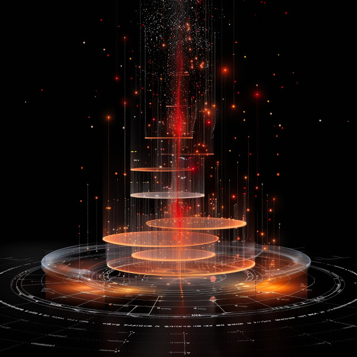

# Master Feeder File

## History

### Timeline: Modernity (1436 CE – 2025 CE):  A Setsafar Commentary

> &ldquo;&lsquo;The victors write the history,&rsquo; or so they say. Luo Guanzhong&rsquo;s *Romance of the Three Kingdoms* demonstrates another principle: &lsquo;but the poet will prove them liars.&rsquo;&rdquo; — Brother Amos Kwan

This period is known by Setsafar scholars as **&ldquo;The Age of Regression&rdquo;** — a time when humanity fell in love with its curiosity and growing knowledge, while regressing into **isolation, elitism, and moral degradation**. The era saw the abandonment of **God**, **neighbor**, and **community**, in favor of **Greco-Roman Ideals**, resulting in rigid patriarchal systems that limited the rights of women, abandoned community symbiosis for totalitarian structures in both Church and state, redefined its real comming of age as the **Dark Ages**.

> &ldquo;True progress occurs only when Rahnami is treasured by all.&rdquo; &#x2013; Father Sadeq Abdi

1.  Pre-Modernity (ca. 1250 CE)

    -   **1250**: Roger Bacon lays the groundwork for the **so-called Renaissance**.
    -   Setsafar views Bacon’s contributions as **positive advancements in scientific inquiry**, but criticizes the later **secularization of knowledge**, when the pursuit of knowledge became **detached from relational wisdom**.
        
        > &ldquo;All knowledge is relational. When it is sought for its own sake, if it is sought without personal interaction with the Dao [God] and man, it is deception that we seek.&rdquo; &#x2013; Brother Zou Delan

2.  Beginning of the Dark Era (1300 CE)

    -   Setsafar calls the **Italian Renaissance** the **&ldquo;Beginning of the Dark Era&rdquo;**, seeing it as a return to **pagan ideals**, **human-centered glorification**, **hubris**, and **absolutist politics**.
    -   The Renaissance, from their perspective, was **not a rebirth of wisdom** but a **reversion to adolescence**, glorifying **individual achievement** over **relational responsibility** and **symbiotic governance**.
    -   **&ldquo;The Renaissance was a rejection of the relational worldview. It glorified man apart from his Creator&rdquo; and apart from each other.**
        
        > &ldquo;Knowledge does not beckon us to change. It may even tell us that we were better off as adolescents. Wisdom, however, demands that we change, or it will not lend us its aid.&rdquo; &#x2013; Lady Tao Ya

3.  Gutenberg Press Invented (1436 CE)

    -   Seen by Setsafar as **both a blessing and a curse**.
    -   While it democratized knowledge, it also **amplified both wisdom and error**, making truth more accessible, but also spreading falsehood more efficiently.
        
        > &ldquo;Technology is a tool we are graciously granted. It is always more than we deserve. For by it, wisdom is spread more efficiently and is made more accessible. For by it, error is spread more efficiently and is made more accessible. What error cannot account for, is its own destruction in the wake. Wisdom always bears better fruit, so technology is to be striven for, always.&rdquo; — Brother Samuel Ferris

4.  Protestant Reformation (1517 CE)

    -   Setsafar sees the **early Reformation** as a **response to the Renaissance**. Growing **superstitions** were rampant within the Church, and **state absolutism** was taking hold. If **state power** had fully solidified in the **Holy Roman Empire** by Luther’s day, his stance may never have succeeded.
    -   But alas, the Reformation **lost its way after Calvin**. It became engrossed in **hyper-materialism**, ultimately returning to **the same hubris** that fueled the **Renaissance**.
        
        > “The Church is not wood and stone, but the company of believing men, one soul in a thousand bodies.” — Martin Luther
        
        > “Without knowledge of self, there is no knowledge of God. Without knowledge of God, there is no knowledge of self.” — John Calvin
        
        > “It’s natural to believe in the supernatural. It never feels natural to accept only natural things.” — Henri de Lubac

5.  Rise of Scholastic Protestantism (1572 CE)

    -   **Petrus Ramus** was **a towering figure in the reform of logic and education**. He sought to **simplify Aristotelian logic**, making it **accessible and practical** for **real-world application**. His influence on **Protestant Scholasticism** was **paramount**, shaping **educational systems** and **philosophical thought** well into **modern times**.
    -   Setsafar praises his efforts to **democratize knowledge** and **reject the elitism** of **university systems** that treated **logic as an abstract art**, rather than **a tool for discernment and wisdom**.
        
        > “Knowledge must serve life. It must be a tool for discernment, not a labyrinth of endless abstractions.” — Petrus Ramus

6.  Althusius&rsquo; Magnum Opus *On Politics* (1603 CE)

    -   Setsafar sees **Johannes Althusius** as **the most important thinker of modernity**.
    -   Where other political writings wrestle with **the control of everything**, Althusius focused on **humankind&rsquo;s hearts**. Instead of asking **&ldquo;how should governments rule?&rdquo;**, he asked **&ldquo;how should people live?&rdquo;**. His work shows that **polity is the natural outcome of people living rightly**.
    -   His work on **federalism and symbiotic governance** becomes **a foundational text** for Setsafar philosophy.
    -   **&ldquo;Where others sought power, Althusius sought peace.&rdquo;**
        
        > &ldquo;Ask not &lsquo;how should our rulers behave?&rsquo;
        >  Ask rather &lsquo;how should we behave?&rsquo;
        >  The latter determines the former.&rdquo; — Father Nkosingiphile [name is Zulu for &ldquo;Given by God&rdquo;]

7.  The Peace of Westphalia (1648 CE) and the English Civil War (1642–1651 CE)

    -   Setsafar sees these events as **two sides of the same coin**: both were responses to **absolutism**, but they unfolded in **very different ways**.
    -   **Westphalia** is remembered as **the last major triumph of relational governance**, a peaceful settlement that recognized **local autonomy and religious freedom**.
    -   In contrast, the **English Civil War** represents the **violent consequences** of **failing to uphold relational governance**, leading to **chaos, violence, and the temporary collapse of monarchy**.
        
        > &ldquo;Rahnami is mercy. Before confronting the evil outside, confront the evil inside. Fix the lack of Rahnami in yourself, and then, and only then can you confront the evil outside. If you want a second chance, give it freely. If you want third, fourth, fifth chance, give it freely. You cannot understand the poverty out there, without first confronting the poverty in here.&rdquo; — The Rahnami

8.  Thomas Hobbes&rsquo; *Leviathan* (1651 CE): The retrobate Calvinist

    -   Important to note that Setsafar has accepted the scholarship of A.P. Martinich&rsquo;s *The Two Gods of Leviathan: Thomas Hobbes on Religion and Politics*
    -   **Hobbes&rsquo; Leviathan** is interpreted by Setsafar as **a disastrous return to absolutism**.
    -   Hobbes, a supporter of Cromwell initially, switches back to favor Charles II after Cromwell&rsquo;s failure to produce a successor. Hobbes claims to have never left Calvinism, but instead has tried to remain true to it. His hyper-materialism was Tertullian-like, not secular at all.
    -   **&ldquo;Where Althusius preached mutual responsibility, Hobbes writes a tome defending the Divine Rights of Kings.&rdquo;**
        
        > &ldquo;A man who makes fear the foundation of governance has already abandoned mercy. What he rules is not a commonwealth, but a prison.&rdquo; — Father Nkosingiphile

9.  Glorious Revolution (1688 CE)

    -   Setsafar scholars critique this as **a superficial revolution** that **replaced one absolutist system with another**.
    -   They see **John Locke’s ideas** as **fundamentally flawed**, promoting **individualism over relationalism**.
        
        > “A man alone is a shadow. A man in a family is a tree. A man in a community is a forest.” — Brother Tupaq Amaru

10. America&rsquo;s War Against Freedom (1775 CE)

    -   Setsafar interprets the **American War of Independence** as **a war against freedom** rather than for it.
    -   **&ldquo;The American colonies were freer under England than they ever were under their own government.&rdquo;**
    -   The **mass exodus to Canada** is seen as **a rejection of the American experiment**.
    -   As predicted by **Patrick Henry**, the newly established government became **centralized and controlling**. A **Republic only on paper**.
        
        > &ldquo;The colonists did not fight for liberty. They fought to create their own Leviathan.&rdquo; — Brother Chigu
        
        > &ldquo;Rebelling against a parliamentary monarchy, the Americans created their own parliament (Congress = Supreme Court) and monarch (President).&rdquo; — Doctor Luvsan
        
        > &ldquo;Government is a mirror of its culture. Cut off the head, and it grows an almost identical replacement. Only more vigilant to prevent decapitation — even at the expense of the culture it mirrors. Polity can only change when culture changes.&rdquo; — Mother Bethania [Bethania Noab Azim]

11. World War I (1914 – 1918 CE)

    -   Viewed as **the beginning of the true Anthropocene decline**.
    -   The war to end all wars only brought more.
        
        > &ldquo;Europe is to be drenched in blood&#x2026; because, in an obscure town, a madman kills a prince&rdquo; &#x2013; The Manchester Guardian
        
        > &ldquo;Never think that war, no matter how necessary, nor how justified, is not a crime&rdquo; &#x2013; Earnest Hemingway

12. World War II  and the Cold War (1939 – 1989 CE)

    -   Setsafar chronicles emphasize **the moral failings** of **both Axis and Allied powers**, refusing to **glorify the victors**.
    -   **There were no righteous nations in this war. Only tragedies.**
    -   Cold War was the result of U.S. banks funding totalitarianism.
    
    > &ldquo;By 1919 Krupp was already giving financial aid to one of the reactionary political groups which sowed the seed of the present Nazi ideology. Hugo Stinnes was an early contributor to the Nazi Party (National Socialistische Deutsche Arbeiter Partei). By 1924 other prominent industrialists and financiers, among them Fritz Thyssen, Albert Voegler, Adolph [sic] Kirdorf, and Kurt von Schröder, were secretly giving substantial sums to the Nazis. In 1931 members of the coalowners association which Kirdorf headed pledged themselves to pay 50 pfennigs for each ton of coal sold, the money to go to the organization which Hitler was building.&rdquo; &#x2013; U.S. Kilgore Comitte in their &ldquo;Elimination of German Resouces&rdquo;
    
    > &ldquo;Robert Stinnett’s work *Day of Deceit* presents compelling evidence that Roosevelt’s administration was fully aware that economic sanctions would provoke Japan into war. Rather than preventing conflict, these actions ensured it. One cannot read Stinnett’s account without grappling with the moral implications of such political maneuvering.&rdquo; — Brother Amos Kwan

13. American Wars of Oppression (1990 – 2017 CE)

    -   Setsafar labels this period as **the American empire’s campaign to maintain global hegemony**.
    -   The wars of this era were not about peace, justice, or freedom. They were about control.
        
        > “In other words, war has a momentum of its own and it carries you away from all thoughtful intentions when you get into it. Today, if we went into Iraq, like the president would like us to do, you know where you begin. You never know where you are going to end.” &#x2013; George F. Kennan
        
        > “From a strategic point of view, it has to be seen as a complete failure, and yet it went on for 20 years, why did it go on for 20 years? Because the defense industry companies that make the bombs, that make the planes, that make the vehicles, and also the private military contractors that now are fighting the wars in lieu of public military personnel, they made trillions of dollars as long as the war continued. So they didn’t care if the war was ever won, the goal was for the war to simply continue forever… the point is not to win the war, but to make sure it never ends because you’re going to keep making profits.” &#x2013; Daniel Kovalik

### Timeline: Post Modernity 2025 CE - 3025 CE (a.k.a. by Setsafar Scholars as the late Pre-Bayesian Era)

1.  The Anthropocene Decline (2025 CE – 2150 CE)

    1.  Key Themes
    
        1.  Climate concerns prove ridled by Bernoulli&rsquo;s fallacy of frequentist models with fallacious inference.
        
            There was an undeniable impact on the Eartyh&rsquo;s atmosphere due to carbon emmissions by humankind, but hubris was inserted to make the crisis seem far more extreme, and keep competing third world countries from competing with western markets by trying to enforce &ldquo;Green Policies&rdquo; on early developed economies.

### Timeline from our time to the age of Chronos

1.  Quantum Mastery

    The era is defined by the perfection of Quantum Loop Gravity theory, allowing for the construction of wormholes and sophisticated manipulation of time dilation. This technological leap enables humanity to traverse the stars and manipulate time at an unprecedented scale.

2.  Chronos Wars

    The misuse of these advanced capabilities leads to catastrophic conflicts known as the Chronos Wars. Time dilation becomes a weapon, with civilizations exploiting time discrepancies to gain advantages, creating chaos and instability. The manipulation of time zones disrupts cause and effect, leading to unpredictable and often devastating consequences. Civil governments were the prime targets, as they were vullnerable &ldquo;single points of failure&rdquo;. The results reacked havoc on all civilizations, making trade near impossible, and technological regression for many star systems.

3.  Ethical Collapse

    The initial rejection of state structures in favor of unregulated advancement results in a lack of cohesive control and ethical oversight. This absence of governance and collective responsibility exacerbates the destructive potential of time dilation technologies.

4.  Cultural Reflection

    In the aftermath of the Chronos Wars, societies reflect on the failures and devastation caused by the misuse of time manipulation. This reflection leads to a renewed emphasis on developing a culture of wisdom, ethical considerations, and community responsibility to prevent such a catastrophe from recurring.

5.  Temporal Ethics

    The era inspires new philosophical and ethical frameworks focused on the responsible use of time manipulation. Scholars, scientists, and ethicists work together to create guidelines and practices that balance technological prowess with moral considerations.

6.  Restoration Efforts

    Post-war efforts are concentrated on rebuilding civilizations, restoring stability, and addressing the long-term impacts of time manipulation on societies and individuals. This period marks a return to valuing wisdom and ethical behavior over unchecked technological advancement.
    
    In this post-Chronos Wars era, the rise of a new civilization rooted in Althusian principles brings a hopeful and transformative narrative:
    
    1.  Monastic Origins
    
        Emerging from the devastation, a monastic order finds solace and guidance in Johannes Althusius&rsquo; &ldquo;On Politics.&rdquo; This text becomes the foundation of their practices, emphasizing communal harmony, ethical behavior, and mutual support.
    
    2.  Inclusive Practices
    
        The monastic order expands to include non-practicing members, provided they adhere to the Althusian &ldquo;rules of behavior.&rdquo; This inclusivity fosters a diverse and cohesive community united by shared values rather than uniform beliefs.
    
    3.  Civilization of Symbiosis
    
        As this community grows, it transforms into a civilization that spreads its influence not through conquest but through peaceful integration, cooperation, and mutual benefit. Their model becomes attractive to others seeking stability and harmony in the post-war world.
    
    4.  Ethical Governance
    
        The civilization adopts a system of governance based on Althusian principles, prioritizing the well-being of all members, promoting individual responsibility, and fostering a sense of collective stewardship over resources and societal development.
    
    5.  Cultural Renaissance
    
        This new civilization experiences a cultural renaissance, with a focus on arts, philosophy, and sciences that align with their ethical and communal values. They become a beacon of cultural and intellectual growth in the post-war landscape.
    
    6.  Diplomatic Expansion
    
        Their approach to expansion is diplomatic and symbiotic, forming alliances and integrating other communities through shared values and mutual respect. This method proves effective in creating a large, stable, and peaceful civilization.
    
    7.  Legacy of Peace
    
        The legacy of this civilization stands in stark contrast to the chaos of the Chronos Wars. Their success in building a society based on peace, symbiosis, and love serves as a testament to the power of ethical principles and communal harmony in overcoming adversity and fostering long-term stability.

7.  I. The Precursor Wars: The Catalyst for Change

    1.  1. The Devastating Temporal Wars
    
        -   Chrono-Wars: Around the 18,000th to 19,000th centuries, the galaxy was ravaged by the Temporal Wars. These conflicts, driven by factions seeking to manipulate time dilation for supremacy, caused widespread devastation.
        -   Societal Collapse: The wars led to the collapse of centralized governments as they became targets for annihilation. The realization that central control made civilizations vulnerable was a pivotal moment.
    
    2.  2. The Aftermath
    
        -   Destruction and Despair: The aftermath of the wars left many star systems in ruins. The collective trauma of these conflicts fostered a deep-seated desire for a new form of governance.
        -   Decentralization Movement: Survivors of the wars began to reject centralized power structures, advocating for a system where power was distributed among all individuals.

8.  II. The Birth of the Althusian Commonwealth

    1.  1. Althusian Philosophy
    
        -   Core Principles: Inspired by the philosophies of Althusius, the Althusian Commonwealth emphasized federalism, subsidiarity, and participatory governance.
        -   Community Sovereignty: Each community governed itself, contributing to and supporting the larger commonwealth without a centralized authority.
    
    2.  2. Formation of the Setsafar Commonwealth
    
        -   Organic Growth: Over centuries, communities across the galaxy adopted Althusian principles, forming the Setsafar Commonwealth. This intergalactic network was bound by shared values rather than a central government.
        -   Technological Integration: Advanced communication and AI systems facilitated coordination and cooperation among communities, ensuring unity without centralization.

9.  III. The Structures of the Setsafar Commonwealth

    1.  1. Distributed Governance
    
        -   Local Councils: Each community was governed by local councils, composed of elected members and citizens participating in direct democracy.
        -   Interconnected Networks: Local councils were interconnected, allowing for collective decision-making on issues affecting multiple communities.
    
    2.  2. Technological Empowerment
    
        -   AI and Blockchain: AI systems managed administrative tasks, while blockchain technology ensured transparency and security in governance.
        -   Information Networks: Robust information networks allowed citizens to stay informed and participate in decision-making processes.
    
    3.  3. Resource Sharing
    
        -   Economic Federation: Resources were shared through an economic federation, ensuring equitable distribution and mutual support.
        -   Cultural Exchange: A thriving cultural exchange fostered unity and mutual respect among diverse communities.

10. IV. Maintaining Stability and Security

    1.  1. Collective Defense
    
        -   Citizen Militias: Defense was managed by citizen militias, trained and equipped to respond to threats collectively.
        -   Automated Defenses: Advanced AI-controlled defense systems protected communities, reducing the need for standing armies.
    
    2.  2. Conflict Resolution
    
        -   Mediation and Arbitration: Disputes were resolved through mediation and arbitration, with a focus on restorative justice.
        -   Intercommunity Councils: Councils composed of representatives from multiple communities facilitated conflict resolution and coordinated responses to large-scale challenges.

### Timeline of the Setsafar Commonwealth

1.  18,000th - 19,000th Centuries

    -   Devastating Temporal Wars
    -   Collapse of Central Governments

2.  20,000th Century

    -   Rise of Decentralization Movement
    -   Formation of Althusian Communities

3.  21,000th Century

    -   Birth of the Setsafar Commonwealth
    -   Establishment of Distributed Governance
    -   Technological Integration

4.  22,000th Century and Beyond

    -   Stability and Prosperity
    -   Collective Defense and Security
    -   Cultural and Economic Federation
    
        |----------------|-----------------|-----------------|-----------------|
        |  18,000th      |   19,000th      |   20,000th      |   21,000th      |
        |   Century      |   Century       |   Century       |   Century       |
        |----------------|-----------------|-----------------|-----------------|
        | Devastating    |  Collapse of    |  Rise of        |  Birth of the   |
        | Temporal Wars  |  Central        |  Decentralization| Setsafar        |
        |                |  Governments    |  Movement       | Commonwealth    |
        |                |                 |                 |                 |
        |----------------|-----------------|-----------------|-----------------|
        |                |                 | Formation of    | Establishment   |
        |                |                 | Althusian       | of Distributed  |
        |                |                 | Communities     | Governance and  |
        |                |                 |                 | Technological   |
        |                |                 |                 | Integration     |
        |----------------|-----------------|-----------------|-----------------|

### Visual Representation of the Commonwealth

      Setsafar Commonwealth
          ______________
         |              |
         | Local Councils|
         |______________|
            /     |     \
           /      |      \
    ______/_______|_______\______
    |      |      |      |      |
    | AI   | Blockchain | Info  |
    |_____ |___________ |_______|
       /      /   \     \
    Citizen  Economic  Cultural
    Militias Federation Exchange

## Books

### The Rahnami

Rahnami is the word &ldquo;first given&rdquo;. It was considered the central catechism of the Setsafar monestary, and later for the entire commonwealth.

1.  Principles of the Rahnami

    1.  The first Rahnami is that for love. Love is Rahnami and Rahnami love.
    
    2.  Rahnami for others. Rahnami is something that multiplies as it is spent. So always give Rahnami, so that Rahnami will increase.
    
    3.  Rahnami for the world. Where there is no Rahnami, there is scarcity. Scarcity is overcome by Rahnami. Resources that cannot be made, must be preserved,
    
        and resources that can be made should be shared abundantly.
    
    4.  Rahnami is mercy. Before confronting the evil outside, confront the evil in inside. Fix the lack of Rahnami in yourself, and then, and only then can you
    
         confront the evil outside. If you want a second chance, give it freely. If you want third, fourth, fifth chance, give it freely. You cannot understand the
        poverty out there, without first confronting the poverty in here.
    
    5.  Rahnami is just. But it is mercy first, and foremost, or it is not just at all.

### The Science of Chronos by Doctor Arash Khosravi

*The Science of Chronos* is a fascinating journal written by Dr. Arash Khosravi, an Iranian physicist from the 21st century. After being diagnosed with a terminal disease, Dr. Khosravi chose to enter cryogenic freeze, a state he remained in for thousands of years until his discovery by the cryogen archeology team of the Setsafar Commonwealth. This specialized group within the Archeology Guild focuses on locating and reviving individuals who have been forgotten in cryogenic suspension due to lost records or abandoned labs.

Upon his revival, Dr. Khosravi was found to have several irreparable organs and was given mechanical replacements for his heart, liver, and parts of his brain. Despite these extensive modifications, his cognitive function was remarkably restored, allowing him to retain his identity, memories, and even a sense of loss for his long-gone family.

Dr. Khosravi&rsquo;s unique perspective bridges the vast gap between the 21st century and the 21st millennium. His journal, The Science of Chronos, offers a first-hand account of scientific advancements over millennia, comparing the Age of Chronos&rsquo;s technology with the science of his own era. His writings provide a direct narrative of the evolution of science and technology across two vastly different epochs, without any historical record of the changes in between, making it a significant contribution to the Setsafar Commonwealth&rsquo;s archives.

1.  Dr. Khosravi&rsquo;s Insights

    Dr. Arash Khosravi&rsquo;s journey into the Age of Chronos has led him to a profound realization: the fundamental nature of science has shifted from focusing on the &ldquo;how&rdquo; and &ldquo;what&rdquo; to exploring the intricacies of relationships. In his time, science regarded relationships as outcomes of reality. However, in this new era, the philosophy of science sees existence itself as defined by relationships, emphasizing how interactions shape our identities and understanding of the world. For this era, relationships are not just a part of reality; they are what give life meaning.
    
    1.  Epistemology
    
        The Christian religion believes in a triune god. God is not only self-sufficient, but he is in perfect relationship with himself. Relationship is the fundamental ingredient of the trinity of God. God created everything, and everything has the fundamental fingerprint of this relational deity.
        
        What is the first thing we learn in life but relationships? What are the first and second commandment under which the entire law may be summed up? Love God and love neighbor. Are they not relational?
        
        From epistemology, what is a fact? Is it not the act of relating something with either something else or some property? How do we learn? Is it not from relating the new information with what we already know? We cannot take new information in without the work of relating it with something we know.
        
        What about Thomas Kuhn&rsquo;s observation about the progress of science? The unstated truth is that in order for new information that challlenges the current paradigm can be assimilated, a bridge of trust must first be built between the bringer of the new information and the larger scientific community. Relationships is a universal principle that ties into everything we know. So why not in physics?
    
    2.  From Particles to Systems
    
        The fundamental shift is from seeing particles as the basic units of reality to viewing systems of relationships as the most essential component of nature. In this new age, no object or entity is understood in isolation. Instead, each entity’s properties and behaviors are fully dependent on its context, its interactions with other systems, and the network of relationships in which it is embedded.
        
        For example, instead of describing an electron simply as a particle with mass and charge, we now describe it based on its relationships with the surrounding electromagnetic field, other particles, and the observer. In this sense, nothing exists independently—it is the network that defines the nature of things.
    
    3.  Probability
    
        In the Age of Chronos, the understanding and application of probability have evolved significantly from Dr. Khosravi&rsquo;s era. In his time, debates raged between Frequentists, who viewed probability as the long-run frequency of events, and Bayesians, who saw it as a measure of belief or certainty given prior knowledge. However, in the 21st millennium, these debates are considered antiquated.
        
        1.  Probability in the Age of Chronos
        
            The second great shift is in how we approach probability. In the pre-Chronos age, Frequentism dominated, where probabilities were calculated from the frequency of events in repeated experiments. But in the Age of Chronos, the world is not fixed and repetitive in the same way. Instead, probabilities are treated as dynamic, contextual, and self-updating—which brings us to Bayesian inference.
            
            Bayesian inference works on the principle that probabilities are subjective, evolving as new information becomes available. The question changes from &ldquo;What is the absolute probability of X happening?&rdquo; to &ldquo;Given this new information, how do we update our expectations?&rdquo; It is a continuous process of refinement, where we constantly adjust our understanding based on relationships between data, models, and outcomes.
            
            This approach better fits the complex, interrelated world of systems. Now, we ask questions like, &ldquo;How do systems interact over time?&rdquo; and &ldquo;What new relationships can emerge to solve a problem?&rdquo; The focus is on adaptability and exploration, rather than rigid certainty.
        
        2.  From Certainty to Feasibility
        
            The Age of Chronos embraces uncertainty and complexity. Instead of searching for the final, certain answer, we ask, &ldquo;What is feasible?&rdquo; or &ldquo;How can we make this work?&rdquo;
            
            This shift reflects the fluid, relational nature of reality. We accept that no single solution is perfect or final, but instead, we focus on optimization, adjustment, and adaptation. The universe becomes a living system where knowledge evolves, systems interact, and solutions emerge dynamically through the self-modifying process of Bayesian inference.
        
        3.  Law of Succession
        
            Probability is foundational in the Age of Chronos, underpinning the very mechanics of their advanced technologies. The use of complex, continuously self-correcting models allows the inhabitants to manipulate quantum fields, control time dilation, and generate intense gravitational forces for closed-loop fueling systems. These same probabilistic models enable the creation of wormholes, allowing tiny ships to traverse millions of light-years in less than fifteen Earth minutes.
            
            This reliance on adaptive probability models illustrates how far the understanding of uncertainty and prediction has advanced, moving from a static analysis of past events to a dynamic and predictive framework that shapes their reality. The Age of Chronos truly sees probability as what makes the universe go round, continuously adapting to new information and reshaping the boundaries of what is possible.
    
    4.  The Laws of Physics
    
        1.  There Are No Constants in Nature, Except That There Are Constantly No Constants
        
            Dr. Khosravi has learned that the Age of Chronos views constants not as unchanging truths but as provisional tools that simplify models under certain conditions. The history of science is filled with constants that have been revised or discarded as understanding deepened. Some examples include:
            
            1.  Ptolemy&rsquo;s epicycles and deferents.
            2.  Roger Bacon&rsquo;s refractive index.
            3.  Kepler&rsquo;s laws of planetary motion.
            4.  Galileo&rsquo;s law of acceleration.
            5.  Descartes&rsquo; quantity of motion.
            6.  Newton&rsquo;s gravitational constant and his laws of inertia.
            7.  Newton&rsquo;s speed of sound.
            8.  Coulomb&rsquo;s electrostatic constant.
            9.  Boyle, Charles, and Gay-Lussac&rsquo;s gas laws.
            10. The universal gas constant.
            11. Atomic weights as constants in chemistry.
            
            Even in the Age of Chronos, constants like the Boltzmann constant, the speed of light in a vacuum, Einstein&rsquo;s gravitational constant, Planck&rsquo;s constant, and the cosmological constant have been reconsidered or replaced as new discoveries are made.
        
        2.  Constants Are Useful but Conditional
        
            In Dr. Khosravi&rsquo;s reflections, constants are valuable for eliminating sporadic concerns and simplifying models, but they are always tied to specific conditions and contexts. For example, Newton&rsquo;s physics is still quite practical on Earth, particularly near sea level, but its applicability diminishes as conditions change, such as at high velocities or in strong gravitational fields.
        
        3.  We Always Outgrow Models
        
            Dr. Khosravi notes that scientific models are constantly evolving. What once seemed like unchangeable truths eventually give way to more comprehensive understandings. This ever-evolving nature of scientific inquiry means that models are continually being refined or replaced to better fit new data and interpretations of reality. Thus, the Age of Chronos embraces the fluidity of knowledge and the provisional nature of all scientific constants.
    
    5.  Phillosophical Implications
    
        The name Chronos itself, rooted in the Greek word for time, suggests that this revolution deeply involves the dynamic nature of time and change. In the Age of Chronos, time is no longer treated as a mere backdrop against which particles move, but as an integral part of how systems evolve.
        
        1.  Time and Relationships:
        
            Time is understood through the relationships between systems. Just as Rovelli proposed that time is relational, in the Age of Chronos, the passage of time is tied to the evolution of interactions within systems. We no longer think of time as a simple linear progression but as a network of changes that occur within relationships.
        
        2.  Temporal Complexity:
        
            The focus on systems and relationships leads to the study of complex temporal patterns—cycles, feedback loops, and emergent properties that unfold over time. Systems may change in unpredictable ways, and the ability to model and respond to these changes becomes a central focus of science.
    
    6.  Science in the Age of Chronos: Practical Shifts
    
        1.  Relational Modeling:
        
            Scientific models now emphasize networks and interdependencies. Instead of breaking down phenomena into isolated components, models focus on how various systems interact and how their relationships evolve over time. This leads to more holistic, interconnected understandings of natural processes.
        
        2.  Adaptive Technologies:
        
            Technologies are adaptive, drawing on Bayesian principles to self-modify and respond to changing environments. Machines, algorithms, and even medical treatments learn from their interactions with the environment, updating themselves as new information arises.
        
        3.  Collaborative Science:
        
            The relational emphasis also shifts how scientific inquiry itself is conducted. Science becomes a more collaborative, interdisciplinary endeavor, where knowledge is shared and evolved through relationships between disciplines, institutions, and even AI systems. The boundaries between fields blur, and science becomes a dynamic, ever-evolving conversation.

## Characters

### This world is still under construction!

But do not fear. More to come soon!

## Physics

### The Science of Chronos

1.  Unveiling the Physics Behind the Future

    In the universe of **The Age of Chronos**, cutting-edge scientific advancements have unlocked the secrets of time, space, and matter. This section delves into the core physical theories and technologies that define this era, offering insights into the real and speculative science that shapes the narrative.

2.  Time Dilation and Quantum Manipulation

    Explore the fundamentals of time dilation, a phenomenon predicted by Einstein&rsquo;s theory of relativity, and how it has been harnessed in your world.
    
    1.  Understanding Time Dilation
    
        1.  Basics of Time Dilation
        
            Time dilation refers to the difference in elapsed time as measured by two observers, due to relative velocity or differences in gravitational potential. This phenomenon is a key prediction of Einstein&rsquo;s theory of relativity.
            
            1.  Special Relativity
            
                Involves time dilation due to relative motion. As an object approaches the speed of light, time slows down relative to a stationary observer.
            
            2.  General Relativity
            
                Describes time dilation due to gravity. Closer to a massive object, time moves slower compared to regions further away from the gravitational source.

3.  Application in The Age of Chronos

    1.  Harnessing Time Dilation
    
        In your world, time dilation is not just a theoretical concept but a practical technology used to manage resources, enhance productivity, and gain strategic advantages. Explain how advanced quantum technologies and engineering principles have enabled the creation and control of time dilation zones.
        
        1.  Economic and Military Uses
        
            Civilizations use time dilation for economic benefits, such as aging products or speeding up technological development. Similarly, time dilation is employed in military strategies to rapidly develop and deploy new technologies or equipment.
        
        2.  Technology Involved
        
            Describe the technological advancements, such as quantum field manipulation and gravitational engineering, that allow for precise control over time dilation. This can include details about how energy from stars and planetary magnetic fields is used to maintain these zones.
    
    2.  Quantum Manipulation
    
        1.  Rovelli&rsquo;s Relational Quantum Mechanics
        
            According to Carlo Rovelli, the properties of matter at the quantum level are relational—they only exist in relation to other matter or systems. Time and space are not fundamental entities but emerge from the interactions between quantum systems.
            
            1.  Relational Properties
            
                In this framework, quantum states are defined by their interactions. For example, the position, momentum, and other properties of a particle are only meaningful when described in relation to another system.
            
            2.  Implications for Time
            
                Time is no longer a fundamental parameter in the equations of quantum mechanics but rather an emergent property that arises from the quantization of interactions. This means that at the quantum level, space and time as we understand them in classical physics do not exist independently but are products of relational dynamics.
    
    3.  Integration with Relativity
    
        1.  Synthesis of Quantum Mechanics and General Relativity
        
            Your world has achieved a synthesis of these two major theories to manipulate time on a cosmic scale. Advanced quantum technologies and theories allow for the creation of stable time dilation zones and the manipulation of space-time itself.
            
            1.  Practical Implementation
            
                Provide examples of devices or installations that manage time dilation, such as &ldquo;chronomancers&rdquo; or &ldquo;temporal engines,&rdquo; which harness relational properties to stabilize and control time dilation zones.
    
    4.  Speculative Science and Future Directions
    
        1.  Ongoing Research and Theories
        
            Highlight speculative theories or ongoing research in your world that aim to further refine or exploit time dilation. This could include attempts to create more efficient time dilation zones or to use time manipulation for new forms of communication or travel.
        
        2.  Ethical and Philosophical Implications
        
            Reflect on the broader implications of time manipulation, such as ethical concerns, societal impacts, and philosophical questions about the nature of time and existence.

4.  Explore the Physics of Chronos

    Embark on a journey through the scientific wonders of **The Age of Chronos**. Whether you&rsquo;re a science enthusiast or a curious reader, this section offers a fascinating look at the principles that bring this world to life.
    Dive deeper into the mechanics of time, energy, and matter, and see how science fiction is grounded in scientific fact.

5.  Discover the Science 🔭

### Understanding General Relativity: The Basics

Imagine space as a large, flexible fabric, like a trampoline. When you place a heavy object, like a bowling ball, on the trampoline, it causes the fabric to stretch and curve around the object. This is similar to how massive objects like stars and planets curve the space around them.

In the early 20th century, Albert Einstein proposed the theory of general relativity, which revolutionized our understanding of gravity. According to Einstein, gravity isn&rsquo;t just a force between two objects; it&rsquo;s a result of the curvature of space and time (which together make up &ldquo;spacetime&rdquo;) caused by these objects.

Here&rsquo;s a simple breakdown:

1.  Spacetime Curvature

    

    
    
    
    

    
    In the realm of physics, spacetime is often visualized as a flexible, grid-like fabric that can be bent or curved by the presence of mass and energy. Much like placing a heavy object on a trampoline causes it to sag, massive celestial bodies like stars and planets warp the fabric of spacetime around them. This curvature is more pronounced with larger masses, creating gravitational effects that we observe as the force of gravity. The image of spacetime bending under the influence of mass helps illustrate how objects move through the universe, following the curved paths created by these distortions. This phenomenon is a fundamental aspect of Einstein&rsquo;s theory of general relativity, reshaping our understanding of how gravity operates not as a force but as a consequence of spacetime&rsquo;s curvature.
    
     

2.  Gravity as a Path

    

    
    
    
    

    
    Gravity, as described by Einstein&rsquo;s theory of general relativity, is not simply a force pulling objects towards one another. Instead, it is a path that objects follow through the curved fabric of spacetime. Imagine spacetime as a vast landscape shaped by the presence of mass and energy. Massive objects like stars and planets create depressions or curves in this landscape. When smaller objects move through this curved spacetime, they naturally follow the contours created by these depressions. For instance, the Earth orbits the Sun not because it is being pulled by an invisible force, but because the Sun&rsquo;s immense mass curves spacetime in such a way that the Earth travels along this curved path. This understanding of gravity as a geometric property of spacetime fundamentally changes our view of the universe and the forces that shape it.
    
     

3.  Time Dilation

    

    
    
    
    

    
    Time dilation is a fascinating consequence of the curvature of spacetime as described by Einstein&rsquo;s theory of general relativity. This phenomenon occurs because time flows differently depending on the strength of gravitational fields. Near massive objects, where spacetime is significantly curved, time passes more slowly compared to regions with weaker gravitational influence. For example, time ticks slightly slower on the surface of the Earth than it does in outer space. This effect, although minuscule under everyday conditions, becomes pronounced in extreme environments, such as near a black hole. Time dilation has been experimentally verified and plays a crucial role in technologies like GPS, which must account for these differences to provide accurate positioning information. Understanding time dilation not only deepens our comprehension of gravity but also challenges our perceptions of time itself.
    
     

4.  Conclusion

    By understanding how mass and energy can warp the fabric of spacetime, we can explain many cosmic phenomena, from the orbits of planets to the bending of light around stars (gravitational lensing).

### Introduction to Loop Quantum Gravity (LQG)

In the quest to understand the universe&rsquo;s most fundamental forces, Loop Quantum Gravity (LQG) emerges as a compelling theory that seeks to bridge the gap between quantum mechanics and general relativity. While Einstein&rsquo;s theory of general relativity describes gravity as the curvature of spacetime, quantum mechanics governs the subatomic world. LQG attempts to unify these concepts by proposing a discrete structure of spacetime, fundamentally altering our understanding of the universe&rsquo;s fabric.

1.  The Basics of LQG

    

    
    
    
    

    
    Loop Quantum Gravity (LQG) proposes that spacetime is not a smooth continuum but rather consists of tiny, discrete loops. These loops are incredibly small, on the order of the Plank length<a id="fnr.1" class="footref" href="#fn.1" role="doc-backlink">1</a>. In LQG, these loops form a complex, interconnected structure known as a spin network. Spin networks provide a quantum state of the gravitational field, representing the geometry of space at the smallest scales. As these spin networks evolve, they form a &ldquo;spin foam,&rdquo; which describes the quantum evolution of spacetime. This dynamic interplay between spin networks and spin foam suggests that spacetime itself is quantized, with space and time emerging from more fundamental quantum processes.
    
     

2.  Spacetime Quantization

    

    
    
    
    

    
    In this theory, the traditional idea of spacetime as a continuous entity is replaced with the notion of quantization. Just as light is quantized into photons, spacetime itself is thought to be quantized into finite loops. This discrete nature prevents singularities, such as those found in black holes or the Big Bang, by imposing a minimum possible length scale.
    
     

3.  Implications for Gravity and Time

    

    
    
    
    

    
    One of the most intriguing implications of LQG is its potential to explain time and gravity in a quantum framework. Unlike general relativity, which treats gravity as a geometric property of curved spacetime, LQG posits that gravity arises from the interactions of these fundamental loops. This perspective offers a new way to understand gravitational phenomena, particularly in extreme conditions where classical theories break down. In the Age of Chronos, this is a fundamental principle of manipulating time dilation without velocity.
    
     

4.  Time Dilation Zones and Beyond

    

    
    
    
    

    
    In the world of the Age of Chronos, LQG is not just a theoretical framework but a practical tool. The technology derived from LQG allows the creation of time dilation zones without relying on relative velocity. Centuries after the initial discovery, this technology has advanced to the point where entire star systems can be enveloped in these zones, dramatically altering the passage of time within them. This has profound implications for space travel, resource management, and even societal development, as civilizations can manipulate time to suit their needs.
    
     

5.  The Ongoing Journey

    

    
    
    
    

    
    Loop Quantum Gravity is still a developing field, with researchers continuously refining its models and exploring its implications. In the Age of Chronos, however, it serves as a cornerstone of technological advancement, enabling feats once thought impossible and reshaping our understanding of the cosmos.
    
     

6.  Plank Scale

    The Planck scale is a fundamental concept in physics, marking the boundary where quantum mechanics and general relativity converge. It represents the smallest possible units of measurement in the universe, defining the limits of space, time, and energy.
    
    1.  Planck Length (lP):
    
        Approximately 1.62 × 10-35 meters, the smallest distance scale that can be probed with accelerators.
    
    2.  Planck Time (tP):
    
        Approximately 5.39 × 10-44 seconds, the smallest unit of time that can be measured.
    
    3.  Planck Mass (mP):
    
        Approximately 2.176 × 10-8 kilograms, the smallest unit of mass that can be detected.
    
    4.  Planck Energy (EP):
    
        Approximately 1.22 × 1028 electronvolts (eV), the energy scale at which quantum gravity becomes significant.

## Technology

### Technologies of the Setsafar Commonwealth

1.  Nodus: Interstellar Communication

    

    
    
    
    

    
    Nodus is a device made up of
    
    1.  Linker
    2.  Dilation module
    3.  Lorenza corrector
    4.  Kill switch
    
    1.  Linker
    
        The Linker creates a quantum link between the caller and reciever, and particles are formed on the recieving end forming a completely particle replica of the caller. All bodily sensations such as hearing, seeing, touching, and tasting are transmitted to the reciever.
    
    2.  Dilation module
    
        The dilation module dilates the time of the caller to that of the reciever. Only if time frames are synced can meaningful transmission take place. If time dilation is too great, the reciever can also use the dilation module to change their time dilation, forming a less disruptive time dilation medium for both participants. The need for this is rare, and is usually only needed for when traveling hyperspace or for terraform projects, when time dilation differences can sometimes be extreme, depending on the level of terraform progress.
    
    3.  Lorenza corrector
    
        The Lorenza corrector can correct both sender and reciever time dilations in cases where such dilations fluctuate. Mostly during hyperspace travel. The Lorenza corrector is set with a max value, at which point the correction is abandoned. This can be necessary when unpredicted circumstances arise during communication.
    
    4.  The Kill switch
    
        The kill switch is what disconnects the quantum link between sender and reciever. It activiates on hangup, which may occur when the Lorenza corrector has hit its max setting, or if harmful transmissions are made to the connected reciever from the other end. There is some linking between the communicator and the Kill switch that has to occur to make this possible.
        
         

2.  Gravity Mining

    

    
    
    
    

    
    Gravity mining is the process of creating entirely new substances through the use of extremely strong gravitational pull, from the likes of a neutron star or black hole. The easiest manner to describe this process in the real world, is essentially, two particles are bound through quantum mechanics, and once bound, one particle is isolated in a gravity-free container, at absolute zero, and the other is flung into a neutron star or black hole. At a certain point, the linked particle is unlinked, and is something entirely different. What substance you ended up with depended entirely on the starting mass, the gravitational pull of the other particle, the link strength of the two particles, and at which stage the unlinking process begun. The linking and unlinking processes became known as &ldquo;quantum linking&rdquo;. Because the actual matter being used matters very little, and the abundance of matter to use for the process, and even the ability to recycle the created substances, it is possible to mass produce several entirely new substances. Two of the most common substances produced are Saruleum, a super fuel for space travel, and Baruleum, a metal that can withstand speed of light travel.
    
    1.  Saruleum ([Garunzal](../org/Metals/index.md))
    
        1.  From the ancient tongue (similar to Latin), meaning &ldquo;blue&rdquo;.
        2.  Color is silver with streaks of blue light
        
        Saruleum is a soft metal with unusually high levels of electro-magnetism. It is used in lining of fuel tanks for stabilizing anti-matter fuel.
    
    2.  Baruleum ([Sangorn](../org/Metals/index.md))
    
        A hard and heavy metal. Where Saruleum is used to line a spacecraft&rsquo;s fuel tank, Baruleum is used to line the exterior of the craft to withstand &ldquo;faster-than-light&rdquo; travel.
    
    3.  Systhalium ([Valmaur](../org/Metals/index.md))
    
        This would be a hard, but also durable stone or marble like substance, that has the same melting temprature of steel. But more maleable than steel. It is a poor conductor of heat, so it takes a long time to melt, but cools very quickly. Maybe seen as a type of clay, but way more durable.
        
         

3.  Nanobots

    

    
    
    
    

    
    1.  Uses
    
        1.  Medical Tasks:
        
            1.  Targeted drug delivery
            
            2.  Surgical assistance at micro-level
            
            3.  Monitoring health stats and detecting anomalies
        
        2.  Repair Tasks:
        
            1.  Hull and Fuel Tank integrity maintenance
            
                1.  Real-Time Monitoring and Damage Detection: Continuously scan for any structural weaknesses, micro-cracks, or material degradation in both the Baruleum-lined hull and Saruleum-lined fuel tank.
                2.  Precision Repairs: Perform micro-level repairs on the Baruleum and Saruleum materials, ensuring that the hull and fuel tank are always in optimal condition.
                3.  Leak Prevention and Sealing: Identify potential or existing leaks in both the hull and fuel tank, and carry out immediate sealing actions.
                4.  Material-Specific Interactions: Specialized nanobots can work with the unique properties of Baruleum and Saruleum, maintaining or even enhancing their integrity over time.
                5.  Emergency Response: Act quickly to stabilize and repair critical areas during emergencies, such as collision damage or catastrophic material failure.
            
            2.  Internal circuitry and system repairs
            
                1.  Circuitry Integrity: Regular scans and repairs of electrical circuits, including reinforcement of weak points and replacement of failed components.
                2.  Real-Time Debugging: Continuous monitoring of software systems to detect and fix bugs, possibly before they even become problematic. This would include AI-assisted diagnosis and issue resolution.
                3.  Resource Management: Monitoring the usage and distribution of power, fuel, and other resources. This could include optimizing existing systems for better efficiency.
                4.  Data Management: Handling the safe storage and retrieval of data, including repairing and maintaining data servers and backups.
                5.  Mechanical Systems: Physical inspections, lubrication, and fine-tuning of moving parts in machinery and other equipment.
                    
                     

4.  Microbots

    

    
    
    
    

    
    1.  Component replacement or upgrades
    
        1.  Micro-Component Swap-Outs: Changing out very small, delicate components that larger bots might struggle with. Think semiconductors or micro-transistors.
        2.  Surface-Level Inspections: Conducting a microscopic analysis of the new components to ensure they&rsquo;re free from imperfections or microscopic cracks that could lead to failure.
        3.  Software Sync: Updating the micro-level firmware of the new component, if applicable.
        4.  Resource Tagging: Labeling or marking the new components in some way to signal that they have been replaced or upgraded. Maybe they could imprint a microscopic QR code or something similar.
        5.  Nano-Level Material Coating: If a component needs a particular coating for protection or functionality, the nanobots could apply it.
    
    1.  Exploration:
    
        1.  Soil or material analysis on unexplored planets
        
        2.  Atmospheric sampling
    
    2.  Agriculture (and Terraforming)
    
        1.  Initial Soil Creation & Maintenance: Breaking down existing materials to create arable soil and continuously maintaining its quality.
        2.  Nutrient Distribution: Ensuring that essential nutrients are evenly distributed throughout the soil.
        3.  Environmental Regulation: Constant monitoring and adjustment of soil pH, moisture, and temperature.
        4.  Toxin & Pest Removal: Extracting or neutralizing toxins and harmful microorganisms in the soil or atmosphere.
        5.  Climate Manipulation & Weather Prediction: Small-scale adjustments that could lead to larger climate shifts and predicting weather patterns for optimal farming.
        6.  Biological Seeding & Biodiversity Maintenance: Introducing and maintaining bacterial or other microbial life to create a complex, healthy ecosystem.
        7.  Resource Mapping & Resource Optimization: Scanning the local geography for essential elements or minerals and ensuring their optimal utilization for farming and other needs.
        8.  Defensive Measures & Disaster Mitigation: Protecting the terraformed areas from local conditions that could be harmful and mitigating the impact of natural disasters on the soil.
        9.  Monitoring and Data Collection: Keeping track of all the various metrics and sending the data back to a central location for analysis.
        10. Crisis Response: Quick deployment to deal with immediate issues like disease outbreaks or sudden climatic changes that could affect soil or plant health.
        
        1.  robo-insects
        
            Robo-insects are used for polination of crops, and also for fertilizing and caring for the crops. They also defend against locusts and other creatures like them. This may entail carrying nanobots to the threatening organism that will keep them from swarming, or it may entail all out combat against the locusts.
            
             

5.  Computing

    Emphasis on Lambda Calculus
    
    1.  MayimLisp
    
        Very similar to our Scheme. Minimalistic, extensive

### Quantum Oscillator Engine

1.  Overview

    The Quantum Oscillator Engine is an advanced power generation system that leverages the principles of quantum mechanics and the speculative process of entropy cycling observed in black holes and white holes. This engine is capable of providing a nearly inexhaustible source of energy, making it ideal for powering large spacecraft, massive systems such as time dilation fields, wormhole generators, and even planet-wide power grids.

2.  Rovelli&rsquo;s Speculation

    Carlo Rovelli, a prominent physicist known for his work in quantum gravity, has speculated that black holes do not end in singularities but instead undergo a quantum bounce, transitioning into white holes. In this process, the black hole, having absorbed high-entropy matter, reverses its collapse and expels matter in a more ordered state through the white hole phase. This cycle of entropy reversal and redistribution plays a crucial role in the cosmic lifecycle of matter and energy.

3.  Our Adaptation

    Building upon Rovelli&rsquo;s ideas, we propose a speculative adaptation where the black hole&rsquo;s quantum bounce does not merely expel ordered matter, but rather, it facilitates a continual cycling of entropy at the quantum level. In this model, instead of reversing time, the black hole reverses entropy, converting high-entropy matter into low-entropy energy, and then releasing it through a violent bounce as a white hole. This concept has been miniaturized and harnessed within the Quantum Oscillator Engine, allowing for a stable, self-renewing energy source.

### Quantum Oscillator Engine

1.  Overview

    The Quantum Oscillator Engine is an advanced power generation system that leverages the principles of quantum mechanics and the speculative process of entropy cycling observed in black holes and white holes. This engine is capable of providing a nearly inexhaustible source of energy, making it ideal for powering large spacecraft, massive systems such as time dilation fields, wormhole generators, and even planet-wide power grids.

2.  Rovelli&rsquo;s Speculation

    Carlo Rovelli, a prominent physicist known for his work in quantum gravity, has speculated that black holes do not end in singularities but instead undergo a quantum bounce, transitioning into white holes. In this process, the black hole, having absorbed high-entropy matter, reverses its collapse and expels matter in a more ordered state through the white hole phase. This cycle of entropy reversal and redistribution plays a crucial role in the cosmic lifecycle of matter and energy.

3.  Our Adaptation

    Building upon Rovelli&rsquo;s ideas, we propose a speculative adaptation where the black hole&rsquo;s quantum bounce does not merely expel ordered matter, but rather, it facilitates a continual cycling of entropy at the quantum level. In this model, instead of reversing time, the black hole reverses entropy, converting high-entropy matter into low-entropy energy, and then releasing it through a violent bounce as a white hole. This concept has been miniaturized and harnessed within the Quantum Oscillator Engine, allowing for a stable, self-renewing energy source.

4.  The Quantum Oscillator Engine

    The Quantum Oscillator Engine operates by replicating the black hole-to-white hole cycle on a quantum scale. This results in a continuous flow of low-entropy energy that can be used to power some of the most demanding systems in the universe. The engine is composed of three primary fields:
    
    1.  Two Oscillating Fields
    
        There are two oscillating fields within the engine, each of which alternates between &ldquo;black-hole mode&rdquo; and &ldquo;white-hole mode.&rdquo; When one field is in black-hole mode, it compresses matter to a quantum state, reducing its entropy and storing vast amounts of potential energy. Simultaneously, the other field is in white-hole mode, releasing this stored energy in controlled bursts, mimicking the &ldquo;bounce&rdquo; of a white hole. These fields constantly switch modes, ensuring a continuous flow of energy.
    
    2.  **Regulating Field**
    
        The third field, the regulating field, is critical for maintaining system stability. It ensures that the oscillations between the black-hole and white-hole modes are synchronized and balanced, preventing any imbalances or disruptions that could destabilize the engine. This field manages the precise timing and energy flow between the two oscillating fields, ensuring a consistent and reliable energy output.
    
    3.  Applications
    
        -   **Large Spacecraft**: Provides the immense power required for deep space exploration and interstellar travel.
        -   **Time Dilation Systems**: Powers the field generators that control time dilation zones across entire star systems.
        -   **Wormhole Generators**: Sustains the energy demands of creating and maintaining stable wormholes for interstellar trade and travel.
        -   **Planet-Wide Power Sources**: Supplies renewable energy on a planetary scale, supporting advanced civilizations and their infrastructure.
    
    4.  Advantages
    
        -   **Inexhaustible Energy**: The continuous cycling of entropy within the engine ensures a nearly limitless supply of energy.
        -   **High Efficiency**: The process of converting high-entropy matter into low-entropy energy results in minimal waste.
        -   **Versatility**: Can be scaled for use in various applications, from powering small colonies to entire planets.
    
    5.  Challenges
    
        -   **Complexity**: The technology is highly sophisticated, requiring precise control over quantum states and entropy management.
        -   **Stability**: While generally stable, the engine must be carefully monitored to prevent fluctuations that could lead to uncontrolled energy releases.
        
        The Quantum Oscillator Engine represents the pinnacle of energy generation technology, merging advanced quantum mechanics with speculative cosmological theories to create a power source that could sustain the most ambitious endeavors of any advanced civilization.

### Wormholes

Wormholes can be created using special quantum manipulation devices (&ldquo;worm orbitals&rdquo;), but doing so requires a tremendous amount of renewable energy, typically harnessed by quantum oscillators the size of a moon. These devices are incredibly expensive to maintain and can pose extreme dangers if proper precautions are not taken. Despite the costs and risks, wormholes offer significant advantages by drastically reducing travel time and costs along trade routes, making them a valuable asset for connecting very large star systems. While faster-than-light travel is generally more economical, it has greater impacts on time dilation, making wormholes the preferred method for stable, long-term interstellar connections between major hubs.

1.  &ldquo;worm orbitals&rdquo;

    1.  Stable wormhole creation
    
        Using two orbitals to stabilize a wormhole involves placing one orbital at the entrance and another at the exit point. These orbitals work in synchronization to create and maintain a stable and traversable wormhole. The entrance orbital initiates the wormhole, while the exit orbital ensures stability by managing the exotic matter required to keep the wormhole&rsquo;s throat open. This dual-orbital setup is crucial for preventing collapse and ensuring a reliable connection between distant points in space.
    
    2.  Worm Generators (Separate Constructs)
    
        

        
        
        
        

        
        Worm Generators are designed for exploratory missions, temporary connections, or situations where flexibility and adaptability are key. These generators are compact, modular devices that can be deployed quickly and repositioned as needed.
        
        -   **Separate from Fuel Source**: Worm Generators are not self-contained; they rely on a separate, massive energy source, such as a moon-sized quantum oscillator, to power the wormhole. Energy is transferred via highly advanced energy beams or wireless transmission, allowing the generators to operate even when distant from their power source.
        
        -   **Compact and Efficient**: The design of Worm Generators focuses on efficiency and mobility. They are relatively small compared to the integrated structures, featuring streamlined components like quantum field emitters, exotic matter containment units, and communication arrays, all optimized for quick deployment and operational flexibility.
        
        -   **Use Cases**:
            -   **Exploratory Missions**: Ideal for creating wormholes to uncharted regions of space, allowing for the rapid mapping and assessment of new areas.
            -   **Temporary Connections**: Useful for setting up temporary wormholes, such as for emergency evacuations, scientific expeditions, or one-off trade missions.
            -   **Quick Deployment**: The compact design allows these generators to be deployed quickly and efficiently, with the ability to relocate as needed.
        
         
    
    3.  Integrated Wormhole Generators (Massive, All-in-One Structures)
    
        

        
        
        
        

        
        These integrated wormhole generators are designed for established trade routes between major star systems, where a permanent and stable wormhole is required. These generators are massive, moon-sized structures that combine both the wormhole-generating technology and the energy source into one cohesive unit.
        
        -   **Self-Contained Power**: Unlike the separate Worm Generators, these integrated structures house their own quantum oscillators, providing a near-limitless supply of energy to sustain the wormhole indefinitely. This design ensures maximum stability and power, with all systems operating in perfect synchronization.
        
        -   **Massive and Imposing**: The sheer size and complexity of these structures make them a permanent fixture in the regions they serve. They resemble colossal spheres or toroidal structures, equipped with extensive energy conduits, quantum field generators, exotic matter containment units, and defensive systems.
        
        -   **Use Cases**:
            -   **Permanent Trade Routes**: Essential for maintaining stable, long-term wormholes that support ongoing interstellar trade and travel between key star systems.
            -   **High Traffic Hubs**: These structures are ideal for locations where a large volume of traffic passes through the wormhole, requiring continuous, reliable operation.
            -   **Strategic Locations**: Deployed in regions where the wormhole is of critical importance, whether for economic, military, or scientific reasons.
        
         
    
    4.  Exploratory wormhole creation
    
        Exploratory wormhole creation is a more cautious process aimed at mapping and understanding potential exit points before committing to permanent stabilization.
        
        1.  Bayesian predictions for potential exits
        
            Before creating an exploratory wormhole, Bayesian prediction models are used to estimate potential exit points. These models help avoid exits that might disrupt already established star systems or pose other risks.
        
        2.  One orbital creates wormhole
        
            The initial orbital at the starting point creates the wormhole, using quantum field manipulation to open a stable passage through spacetime.
        
        3.  Photars
        
            Photars, or photon ping devices, are used to check the newly created wormhole. They send out photon pings to gather data about the exit environment, helping to determine if the location is suitable for stabilization.
        
        4.  Second orbital goes through wormhole to stabilize from the other side
        
            Once the photars confirm a suitable exit, a second orbital is sent through the wormhole to the exit point. This orbital stabilizes the wormhole from the other side, ensuring long-term stability and safety.
    
    5.  Wormhole closing
    
        Closing a wormhole requires careful preparation to ensure no unintended consequences or residual effects.
        
        1.  Photars are used to make sure nothing else is traveling within the wormhole before closing
        
            Before initiating the closure, photars are employed to ensure that no other objects or travelers are within the wormhole, preventing accidents or unintended losses.
        
        2.  Two different methods for closing the wormhole
        
            There are two primary methods for closing a wormhole, depending on future plans for the exit area.
            
            1.  First procedure, the wormhole is closed from both ends, and the two orbitals remain within their respective places within the universe
            
                In the first method, the wormhole is closed from both the entrance and exit points, with each orbital remaining in its respective location. This method allows for potential future reopening of the wormhole if needed.
            
            2.  Second procedure involves the orbital at the exit end being sent back to the entrance where the other orbital is, and then the wormhole is closed. Second method is used if no returns to the target area are planned for the future
            
                The second method involves returning the exit orbital to the entrance point before closing the wormhole. This method is used when no future travel to the target area is planned, effectively sealing off the connection permanently.

# Footnotes

<a id="fn.1" href="#fnr.1">1</a> Approximately 1.62 × 10-35 meters, the smallest distance scale that can be probed with accelerators.
